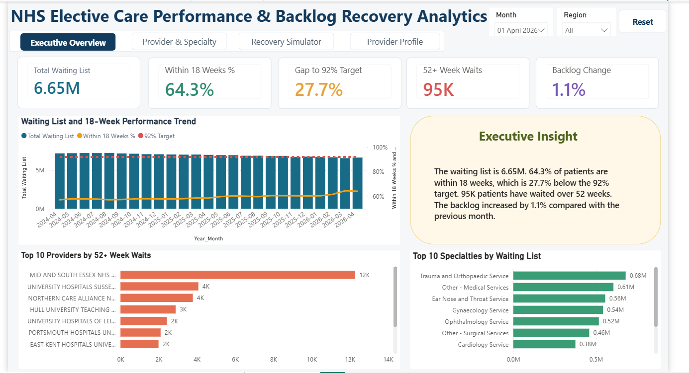
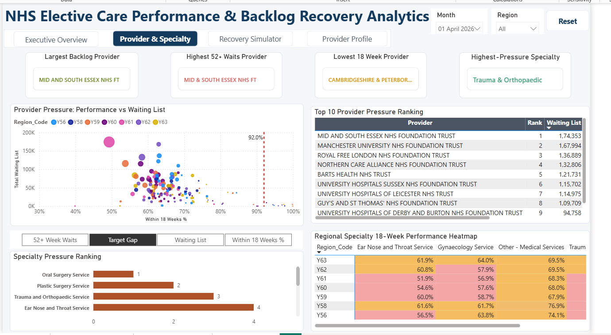
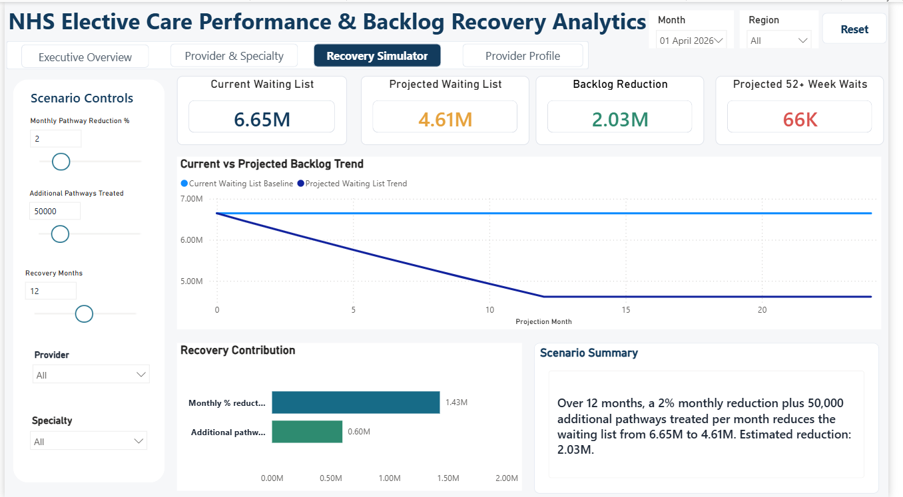
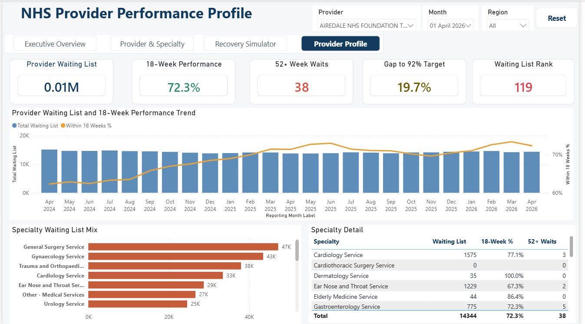

# NHS Elective Care Performance & Backlog Recovery Analytics

This project analyses NHS elective care waiting-list performance using Python, SQL Server and Power BI.

The aim was to build an end-to-end analytics project that combines monthly NHS Referral to Treatment data, prepares a clean analytical dataset, creates a SQL star schema, and presents the results through an interactive Power BI report.

The final dashboard helps monitor waiting-list pressure, 18-week performance, 52+ week waits, provider performance, specialty pressure and backlog recovery scenarios.

---

## Project Overview

NHS elective care waiting lists are a major operational challenge. This project focuses on understanding where pressure exists and how recovery activity could reduce the backlog.

The analysis covers:

- Total waiting-list volume
- 18-week performance
- Gap to the 92% RTT target
- 52+ week waits
- Provider-level pressure
- Specialty-level pressure
- Regional variation
- Recovery scenario modelling
- Provider profile monitoring

---

## Main Results

From the final Power BI report:

| Metric | Result |
|---|---:|
| Total Waiting List | 6.65M |
| Within 18 Weeks % | 64.3% |
| Gap to 92% Target | 27.7% |
| 52+ Week Waits | 95K |
| Backlog Change | 1.1% |
| Recovery Scenario Reduction | 2.03M |
| Projected Waiting List | 4.61M |
| Projected 52+ Week Waits | 66K |

---

## Tools Used

- Python
- SQL Server
- Power BI
- Power Query
- DAX
- Excel / CSV

---

## Project Flow

```text
Monthly NHS Excel files
        |
        v
Python data combination and cleaning
        |
        v
Clean CSV dataset
        |
        v
SQL Server staging table
        |
        v
SQL validation checks
        |
        v
Star schema model
        |
        v
Power BI data model and DAX measures
        |
        v
Interactive Power BI report
```

---

## Data Preparation

Python was used to prepare the monthly NHS RTT files before loading the data into SQL Server.

The notebook:

- loaded multiple monthly NHS Excel files
- extracted the reporting month from the file names
- combined all months into one dataset
- selected the required analytical columns
- cleaned column names and data types
- checked missing values and duplicates
- handled unavailable or invalid values
- exported the final clean CSV file

The final cleaned dataset is available in:

```text
04_clean_data/clean_rtt_summary_data.csv
```

---

## SQL Development

SQL Server was used to create the analytical model used in Power BI.

The SQL work includes:

1. Creating the database and staging table
2. Importing the cleaned CSV file
3. Running staging-level validation checks
4. Creating dimension tables
5. Creating the fact table
6. Building a star schema model
7. Creating analysis views for reporting

The final model includes:

- `Dim_Date`
- `Dim_Provider`
- `Dim_Specialty`
- `Fact_RTT_Performance`

SQL scripts are organised in execution order:

| Script | Purpose |
|---|---|
| `01_create_database_and_staging_table.sql` | Creates database and staging table |
| `02_staging_data_validation.sql` | Runs validation checks on the staged data |
| `03_create_star_schema.sql` | Creates dimension and fact tables |
| `04_create_analysis_views.sql` | Creates reporting views for Power BI |

---

## Power BI Report

The Power BI report contains four pages.

---

### 1. Executive Overview

This page provides a high-level summary of NHS elective care performance.

It includes:

- Total waiting list
- 18-week performance
- Gap to 92% target
- 52+ week waits
- Backlog change
- Waiting-list trend
- Executive insight
- Top providers by 52+ week waits
- Top specialties by waiting list



---

### 2. Provider & Specialty

This page focuses on provider and specialty pressure.

It includes:

- Largest backlog provider
- Highest 52+ waits provider
- Lowest 18-week provider
- Highest-pressure specialty
- Provider pressure scatter chart
- Top 10 provider pressure ranking
- Specialty pressure ranking
- Regional specialty heatmap



---

### 3. Recovery Simulator

This page allows different backlog recovery scenarios to be tested.

The simulator uses:

- Monthly pathway reduction %
- Additional pathways treated
- Recovery months
- Provider filter
- Specialty filter

In the example scenario, a 2% monthly reduction plus 50,000 additional treated pathways reduces the waiting list from 6.65M to 4.61M over 12 months.



---

### 4. Provider Profile

This page gives a detailed view of one selected provider.

It includes:

- Provider waiting list
- 18-week performance
- 52+ week waits
- Gap to 92% target
- Waiting-list rank
- Provider trend over time
- Specialty waiting-list mix
- Specialty detail table



---

## Power BI Features

The report includes:

- KPI cards
- Trend charts
- Ranking visuals
- Scatter chart
- Regional heatmap
- Recovery simulator
- Dynamic scenario summary
- Provider-level profile page
- Month and region slicers
- Provider and specialty slicers
- Reset buttons
- Page navigation buttons
- DAX measures for waiting-list and performance metrics

---

## Key Measures

Some of the main measures created in Power BI include:

- Total Waiting List
- Within 18 Weeks %
- Gap to 92% Target
- 52+ Week Waits
- Monthly Backlog Change %
- Projected Waiting List
- Backlog Reduction
- Projected 52+ Week Waits
- Provider Waiting List Rank
- Specialty Waiting List
- Specialty Within 18 Weeks %
- Specialty 52+ Waits
- Specialty Pressure Rank

---

## Key Insights

The report highlights that:

- The overall waiting list remains high across the reporting period.
- 18-week performance is below the 92% target.
- A small group of providers contributes heavily to long waits.
- Specialty pressure differs across regions.
- Recovery activity can reduce the projected backlog when pathway reduction and extra treated pathways are increased.
- Provider-level analysis helps identify where performance issues are concentrated.

---

## Repository Structure

```text
nhs-elective-care-analytics
|
├── 02_python
│   └── 01_combine_clean_rtt_data.ipynb
|
├── 04_clean_data
│   └── clean_rtt_summary_data.csv
|
├── 05_sql
│   ├── 01_create_database_and_staging_table.sql
│   ├── 02_staging_data_validation.sql
│   ├── 03_create_star_schema.sql
│   └── 04_create_analysis_views.sql
|
├── 06_power_bi
│   └── NHS_Elective_Care_Analytics.pbix
|
├── 08_screenshots
│   ├── 01_executive_overview.png
│   ├── 02_provider_specialty.png
│   ├── 03_recovery_simulator.png
│   └── 04_provider_profile.png
|
└── README.md
```

---

## How to Run the Project

1. Use the cleaned CSV file from the `04_clean_data` folder.
2. Run the SQL scripts in the `05_sql` folder in numerical order.
3. Open the Power BI file from the `06_power_bi` folder.
4. Refresh the Power BI model if required.
5. Use the slicers, navigation buttons and recovery simulator to explore the report.

Note: The raw monthly NHS Excel files were used locally during development and are not included in this repository. The cleaned dataset used for SQL and Power BI is included.

---

## Files Included

| Folder | Description |
|---|---|
| `02_python` | Python notebook used for data cleaning |
| `04_clean_data` | Final cleaned CSV dataset |
| `05_sql` | SQL scripts for staging, validation, star schema and views |
| `06_power_bi` | Final Power BI report file |
| `08_screenshots` | Screenshots of the final report pages |

---

## Skills Demonstrated

This project demonstrates:

- Data cleaning with Python
- Data validation
- SQL Server development
- Star schema modelling
- Power BI dashboard design
- DAX measure creation
- Healthcare performance analysis
- Scenario modelling
- KPI reporting
- Dashboard storytelling

---

## Notes

This project uses aggregated NHS elective care data. It does not contain patient-level personal data.

---

## Author

Rahul Chhabra  
Data Analyst  
GitHub: rahulchhabra039
